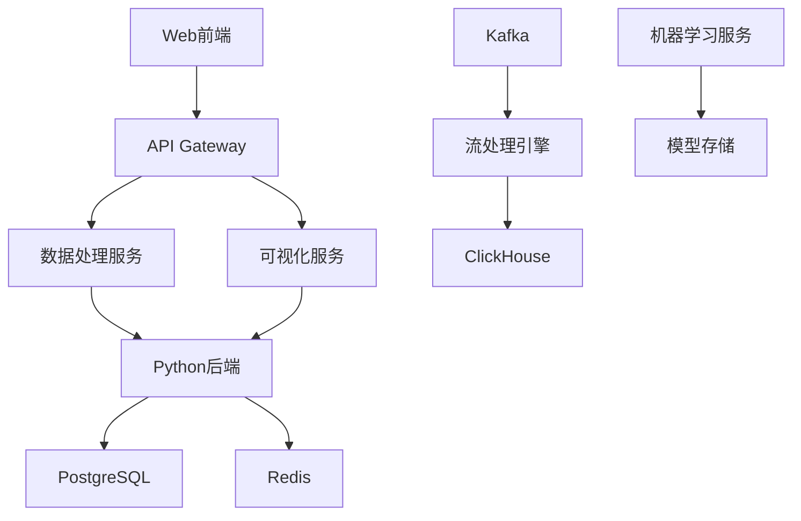

# ⚡ 项目 B（占位）

<div class="project-meta">
  <div class="project-links">
    <a href="https://github.com/占位/项目B" target="_blank" class="project-link">📦 GitHub</a>
    <a href="https://blog.csdn.net/占位/article/details/占位" target="_blank" class="project-link">📝 CSDN</a>
  </div>
  <div class="project-tags">
    <span class="tag">React</span>
    <span class="tag">Python</span>
    <span class="tag">PostgreSQL</span>
  </div>
</div>

## 项目简介

使用 React 前端和 Python 后端开发的数据分析平台，支持实时数据处理和图表可视化。该平台为企业提供数据洞察和决策支持，具有强大的数据处理能力和友好的用户界面。

## 核心功能

- 📊 **数据采集**: 支持多种数据源接入
- 🔄 **实时处理**: 流式数据处理和分析
- 📈 **可视化**: 丰富的图表展示组件
- 🎯 **智能分析**: AI 驱动的数据洞察
- 📋 **报表生成**: 自动化报表和导出

## 技术栈

### 前端技术
- **框架**: React 18 + TypeScript
- **状态管理**: Redux Toolkit
- **图表库**: ECharts + D3.js
- **UI 组件**: Ant Design
- **构建工具**: Webpack 5

### 后端技术
- **语言**: Python 3.10+
- **框架**: Django + Django REST Framework
- **数据库**: PostgreSQL + Redis
- **数据处理**: Pandas + NumPy
- **机器学习**: Scikit-learn + TensorFlow

### 数据处理
- **流处理**: Apache Kafka
- **任务队列**: Celery + Redis
- **数据仓库**: ClickHouse
- **监控**: Prometheus + Grafana

## 系统架构



## 主要特性

### 1. 数据处理能力
- 支持百万级数据实时处理
- 多种数据源接入（MySQL、MongoDB、API等）
- 数据清洗和预处理
- 异常检测和数据质量监控

### 2. 可视化组件
- 50+ 图表类型（柱状图、折线图、饼图等）
- 自定义图表配置
- 交互式数据探索
- 移动端适配

### 3. 智能分析
- 自动化异常检测
- 趋势预测
- 关联分析
- 智能推荐

## 数据流程

### 1. 数据采集
```python
# 数据采集示例
class DataCollector:
    def collect_from_mysql(self):
        # 从MySQL采集数据
        pass
    
    def collect_from_api(self):
        # 从API采集数据
        pass
```

### 2. 数据处理
```python
# 数据处理示例
class DataProcessor:
    def clean_data(self, data):
        # 数据清洗
        return cleaned_data
    
    def transform_data(self, data):
        # 数据转换
        return transformed_data
```

### 3. 数据分析
```python
# 数据分析示例
class DataAnalyzer:
    def detect_anomalies(self, data):
        # 异常检测
        return anomalies
    
    def predict_trends(self, data):
        # 趋势预测
        return predictions
```

## 性能指标

- ⚡ **数据处理**: 100万条/秒
- 🔄 **查询响应**: < 500ms
- 📊 **并发用户**: 500+
- 📦 **数据存储**: TB 级
- 🧪 **准确率**: 95%+

## 项目亮点

1. **高性能处理**: 支持百万级数据实时处理
2. **智能分析**: AI 驱动的数据洞察和预测
3. **可视化丰富**: 50+ 图表类型，满足不同需求
4. **扩展性强**: 模块化设计，易于集成新功能
5. **用户友好**: 直观的界面和操作体验

## 部署架构

### 生产环境
- **前端**: Nginx + CDN
- **后端**: Docker + Kubernetes
- **数据库**: PostgreSQL 集群
- **缓存**: Redis 集群
- **消息队列**: Kafka 集群

### 监控体系
- **系统监控**: Prometheus + Grafana
- **日志收集**: ELK Stack
- **链路追踪**: Jaeger
- **告警通知**: AlertManager

## 安全措施

- 🔐 **数据加密**: 传输和存储加密
- 🛡️ **访问控制**: RBAC 权限管理
- 🔍 **审计日志**: 完整的操作记录
- 🚫 **数据脱敏**: 敏感信息保护

## 未来规划

- [ ] 支持更多数据源类型
- [ ] 增强AI分析能力
- [ ] 优化大数据处理性能
- [ ] 添加协作功能

---

## 📊 项目数据

- **开发周期**: 8 个月
- **代码行数**: 15000+
- **数据处理量**: 10TB+
- **企业客户**: 20+
- **日处理请求**: 100万+
