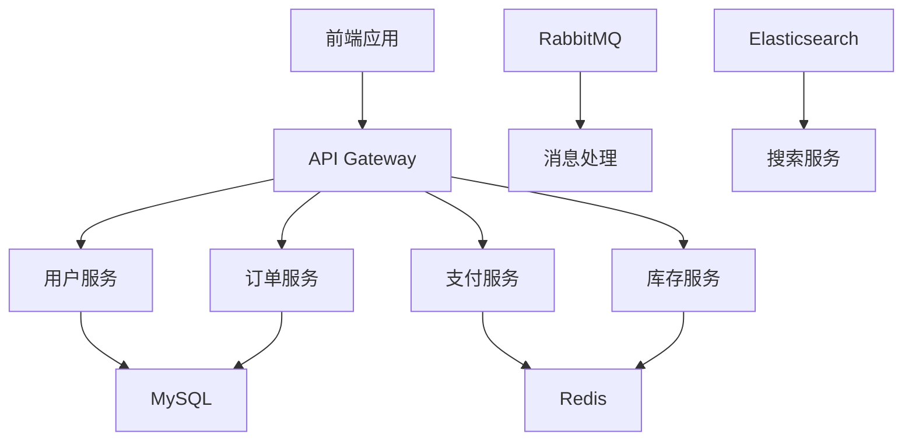
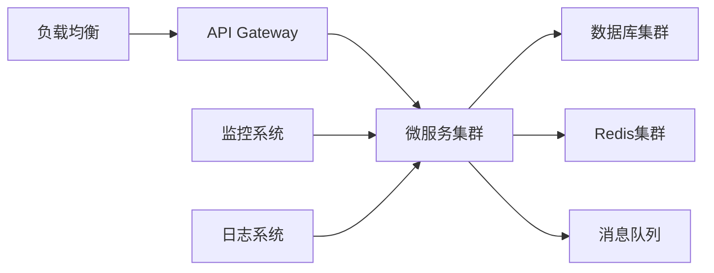

# 🌐 全栈开发实践项目

<div class="project-meta">
  <div class="project-links">
    <a href="https://github.com/djxqwq" target="_blank" class="project-link">📦 GitHub</a>
    <a href="#" target="_blank" class="project-link">📝 课程报告</a>
  </div>
  <div class="project-tags">
    <span class="tag">Vue.js</span>
    <span class="tag">Spring Boot</span>
    <span class="tag">RESTful API</span>
    <span class="tag">MySQL</span>
  </div>
</div>

## 项目简介

软件工程课程的全栈开发实践项目，涵盖需求分析、系统设计、前后端开发、测试部署完整流程。采用现代化技术栈，实现用户管理、数据处理、可视化展示等核心功能模块。

## 核心功能

- � **用户管理**: 注册、登录、个人信息管理
- � **数据处理**: 数据采集、清洗、分析和存储
- � **可视化展示**: 图表展示和数据报表
- � **搜索功能**: 全文搜索和高级筛选
- � **响应式设计**: 支持多端访问
- �🔐 **权限控制**: 基于角色的访问控制

## 技术栈

### 前端技术
- **框架**: Vue.js 3 + Composition API
- **状态管理**: Pinia
- **UI组件**: Element Plus
- **构建工具**: Vite
- **图表库**: ECharts

### 后端技术
- **框架**: Spring Boot 2.7+
- **数据库**: MySQL 8.0 + Redis
- **API**: RESTful API
- **认证**: JWT + Spring Security

### 开发工具
- **版本控制**: Git + GitHub
- **测试**: Jest + JUnit
- **CI/CD**: GitHub Actions

## 系统架构



## 核心模块

### 1. 用户服务
- 用户注册/登录
- JWT 认证
- 权限管理（RBAC）
- 用户信息管理

### 2. 订单服务
- 商品下单
- 订单状态管理
- 库存扣减
- 订单查询

### 3. 支付服务
- 支付宝/微信支付
- 支付回调处理
- 退款功能
- 支付记录

### 4. 库存服务
- 商品库存管理
- 库存预占/释放
- 库存预警
- 库存统计

## 数据库设计

### 用户表 (users)
```sql
CREATE TABLE users (
    id BIGINT PRIMARY KEY AUTO_INCREMENT,
    username VARCHAR(50) UNIQUE NOT NULL,
    email VARCHAR(100) UNIQUE NOT NULL,
    password_hash VARCHAR(255) NOT NULL,
    created_at TIMESTAMP DEFAULT CURRENT_TIMESTAMP,
    updated_at TIMESTAMP DEFAULT CURRENT_TIMESTAMP ON UPDATE CURRENT_TIMESTAMP
);
```

### 订单表 (orders)
```sql
CREATE TABLE orders (
    id BIGINT PRIMARY KEY AUTO_INCREMENT,
    user_id BIGINT NOT NULL,
    order_no VARCHAR(32) UNIQUE NOT NULL,
    total_amount DECIMAL(10,2) NOT NULL,
    status TINYINT DEFAULT 0,
    created_at TIMESTAMP DEFAULT CURRENT_TIMESTAMP,
    FOREIGN KEY (user_id) REFERENCES users(id)
);
```

## API 设计

### 用户相关
```
POST   /api/auth/login      # 用户登录
POST   /api/auth/register   # 用户注册
GET    /api/users/profile   # 获取用户信息
PUT    /api/users/profile   # 更新用户信息
```

### 订单相关
```
POST   /api/orders          # 创建订单
GET    /api/orders/{id}     # 获取订单详情
GET    /api/orders/list     # 获取订单列表
PUT    /api/orders/{id}     # 更新订单状态
```

## 性能优化

### 1. 数据库优化
- 索引优化，提升查询速度
- 读写分离，分散数据库压力
- 连接池配置，管理数据库连接

### 2. 缓存策略
- Redis 缓存热点数据
- 本地缓存配合 Redis
- 缓存预热和失效策略

### 3. 接口优化
- 接口响应时间 < 200ms
- 分页查询，避免大量数据传输
- 异步处理，提升并发能力

## 安全措施

### 1. 认证授权
- JWT Token 认证
- RBAC 权限控制
- 接口权限验证

### 2. 数据安全
- 密码加密存储
- 敏感数据脱敏
- SQL 注入防护

### 3. 系统安全
- 接口限流
- 防 XSS 攻击
- CSRF 防护

## 监控告警

### 1. 系统监控
- CPU、内存、磁盘使用率
- 接口响应时间
- 错误率统计

### 2. 业务监控
- 订单量统计
- 支付成功率
- 用户活跃度

### 3. 告警机制
- 系统异常告警
- 业务指标异常告警
- 自动故障恢复

## 项目亮点

1. **微服务架构**: 模块化设计，易于扩展和维护
2. **高并发处理**: 支持万级并发，响应时间 < 200ms
3. **数据一致性**: 分布式事务保证数据一致性
4. **完善的监控**: 全方位监控和告警机制
5. **自动化部署**: CI/CD 流水线，一键部署

## 部署架构



---

## 📊 项目数据

- **开发周期**: 6 个月
- **代码行数**: 20000+
- **接口数量**: 100+
- **日活用户**: 10000+
- **订单量**: 50000+/天
- **系统可用性**: 99.9%
